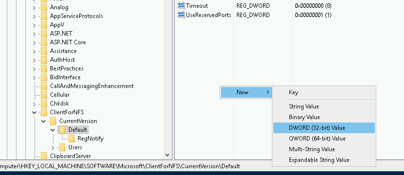

##  Overview

We want to create a file server so that my IIS web sites uses same file location as their IIS virtual directory. In Google Cloud Platform, we will be using [Cloud Filestore](https://cloud.google.com/filestore/docs/quickstarts?hl=zh-tw) as our managed file share service.

####    Create Filestore Service

-   Create Filestore instance


-   Once created, notedown it's private IP address


-   RDP into domain joined Windows machine, start Powershell and execute below command to install NFS client

```powershell
Install-WindowsFeature -Name NFS-Client
```

-   Run Regedit, open HKEY_LOCAL_MACHINE\SOFTWARE\Microsoft\ClientForNFS\CurrentVersion\Default

-   Create below DWORD(32-bit) items

    -   AnonymousUid
    -   AnonymousGid




-   Restart NFS, run below Powershell commands

```powershell
nfsadmin client stop
nfsadmin client start
```

-   Open File Explorer, Map Network driver if required


####    Setup IIS

Now we want to verify if authorized computers have access to Filestore shares

-   Create a new Compute Engine Instance with pre-prepared image which already have everything setup.

-   Join the newly created instance to domain

-   I have pre-created a sample ASP.Net project [here](../002-windows-container/aspnet/). Compile and [copy everything](https://cloud.google.com/filestore/docs/copying-data) to \\\\[FileStore Instance Name]\\[File Store Share name]\\wwwroot

-   Open IIS Manager, Create a new website and points physical location to above file share


-   Open browser, you should see ASP.Net default welcome page displayed


####    References

-   https://www.twblogs.net/a/5b90dea02b71771c6186cb5e