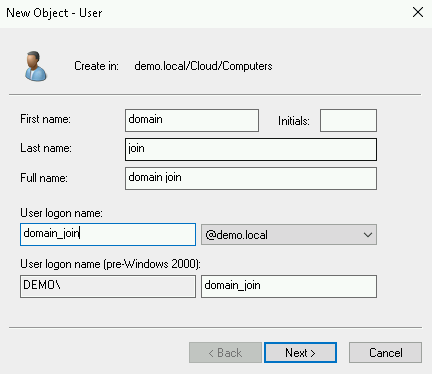

##  Overview

I use Managed Microsoft Active Directory instead of creating VM to setup Domain.

####    Create OU for auto-provisioned machines

-   RDP to a Windows VM with AD management tool installed. Create a new OU named "GCP"

-   Create a new user (CompRegistrar) and grant it permission to manage computer accounts

    Note that, in my case, my domain name is "Demo.Local" and my OU is "GCP", hence my OrgUnit Paht is set as below. 

    You can follow this [document](https://docs.microsoft.com/en-us/powershell/module/addsadministration/get-adorganizationalunit?view=win10-ps) top get your OU [distinguished name](https://docs.microsoft.com/en-us/previous-versions/windows/desktop/ldap/distinguished-names) 

    We will use this use to join new machine instances to domain.

```powershell
$BaseOrgUnitPath="OU=GCP,OU=Cloud,DC=demo,DC=local"

## Create user account under OUs
$Password=[Guid]::NewGuid().ToString()+"-"+[Guid]::NewGuid().ToString()
$UpnSuffix=(Get-ADDomain).DNSRoot
$CompRegistrar = New-ADUser `
 -Name "Computer Registrar" `
 -GivenName "Computer" `
 -Surname "Registrar" `
 -Path $BaseOrgUnitPath `
 -SamAccountName "CompRegistrar" `
 -UserPrincipalName "CompRegistrar@$UpnSuffix" `
 -AccountPassword (ConvertTo-SecureString "$Password" -AsPlainText -Force) `
 -PassThru
$CompRegistrar | Enable-ADAccount

## Grant permissions to managed computer accounts in OU
& dsacls.exe $BaseOrgUnitPath /G $CompRegistrar":CCDC;Computer" /I:T | Out-Null
& dsacls.exe $BaseOrgUnitPath /G $CompRegistrar":LC;;Computer" /I:S | Out-Null
& dsacls.exe $BaseOrgUnitPath /G $CompRegistrar":RC;;Computer" /I:S | Out-Null
& dsacls.exe $BaseOrgUnitPath /G $CompRegistrar":WD;;Computer" /I:S | Out-Null
& dsacls.exe $BaseOrgUnitPath /G $CompRegistrar":WP;;Computer" /I:S | Out-Null
& dsacls.exe $BaseOrgUnitPath /G $CompRegistrar":RP;;Computer" /I:S | Out-Null
& dsacls.exe $BaseOrgUnitPath /G $CompRegistrar":CA;Reset Password;Computer" /I:S | Out-Null
& dsacls.exe $BaseOrgUnitPath /G $CompRegistrar":CA;Change Password;Computer" /I:S | Out-Null
& dsacls.exe $BaseOrgUnitPath /G $CompRegistrar":WS;Validated write to service principal name;Computer" /I:S |
& dsacls.exe $BaseOrgUnitPath /G $CompRegistrar":WS;Validated write to DNS host name;Computer" /I:S | Out-Null
```

    

-   Move the newly created user to "GCP" OU

```powershell
$Password=[Guid]::NewGuid().ToString()+"-"+[Guid]::NewGuid().ToString()
$UpnSuffix=(Get-ADDomain).DNSRoot
$CompRegistrar = New-ADUser `
 -Name "Computer Registrar" `
 -GivenName "Computer" `
 -Surname "Registrar" `
 -Path $BaseOrgUnitPath `
 -SamAccountName "CompRegistrar" `
 -UserPrincipalName "CompRegistrar@$UpnSuffix" `
 -AccountPassword (ConvertTo-SecureString "$Password" -AsPlainText -Force) `
 -PassThru
$CompRegistrar | Enable-ADAccount
```

