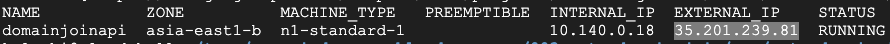

##  Overview

We need to setup our GCP project in order to access domain resources. There are several options to host our domain join API

-   Cloud Function
    
    In order to be able access domain resource we need setup Serverless VPC access here.

-   GKE

    GKE is natively integrated with VPC

-   Compute Enginer with Container

    GCE is natively integrated with VPC

-   AppEngine Flexible Environment

-   Compute Engine

####    Setup Serverless VPC Access (Required for Cloud Functions)

-   Go to Google Cloud Console

-   Open up Cloud shell

-   Execute below commands, where

    -   your_gcp_project is your GCP project id
    -   vpc-name is your vpn name which will be using for Serverless VPC access
    -   serverless-region is the region you used for serverless VPC access
    -   serverless-ip-range is an unused /28 IP range for Serverless VPN access

```shell
export DOMAIN_PROJECT_ID=your_gcp_project
export VPC_NAME=vpc-name
export SERVERLESS_REGION=serverless-region
export SERVERLESS_IP_RANGE=serverless-ip-range
```


####    Deploy Domain Join API to Container hosted in Compute Engine instance

-   Clone sample domain join applications from [here](https://github.com/GoogleCloudPlatform/gce-automated-ad-join/tree/master/register-computer).

    Also created a [Dockerfile](./src//auto-domain-join/register-computer/Dockerfile) so that we can deploy it to servives such as GKE.

-   Build docker image and push to Google Container Registry

```shell
docker build . -t gcr.io/$DOMAIN_PROJECT_ID/register-computer:latest
docker push gcr.io/$DOMAIN_PROJECT_ID/register-computer:latest
```

-   Deploy container to Compute Engine

```shell
export INSTANCE_NAME=domainjoinapi
gcloud beta compute --project=$DOMAIN_PROJECT_ID instances create-with-container $INSTANCE_NAME --zone=asia-east1-b --machine-type=n1-standard-1 --subnet=$VPC_NAME --metadata=google-logging-enabled=true,google-monitoring-enabled=true --scopes=https://www.googleapis.com/auth/cloud-platform --tags=http-server,https-server --image=cos-stable-80-12739-68-0 --image-project=cos-cloud --boot-disk-size=10GB --boot-disk-type=pd-standard --boot-disk-device-name=$INSTANCE_NAME --container-image=gcr.io/$DOMAIN_PROJECT_ID/register-computer:latest --container-restart-policy=always

##  Create firewall rules when required
# gcloud compute --project=$DOMAIN_PROJECT_ID firewall-rules create default-allow-http --direction=INGRESS --priority=1000 --network=default --action=ALLOW --rules=tcp:80 --source-ranges=0.0.0.0/0 --target-tags=http-server

# gcloud compute --project=$DOMAIN_PROJECT_ID firewall-rules create default-allow-https --direction=INGRESS --priority=1000 --network=default --action=ALLOW --rules=tcp:443 --source-ranges=0.0.0.0/0 --target-tags=https-server

#   Update container image
gcloud compute instances update-container $INSTANCE_NAME  \
    --container-image gcr.io/$DOMAIN_PROJECT_ID/register-computer:latest
```

-   Once deployed, wait for a few minutes until container is up and running and browse to the public IP of the compute instance.



####    Create Cloud KMS

We use Cloud KMS to securely store password.

-   Enable Cloud KMS API and create a Cloud KMS instance

```shell
gcloud services enable cloudkms.googleapis.com --project=$DOMAIN_PROJECT_ID

gcloud kms keyrings create computer-registrar-keyring \
 --location global \
 --project=$DOMAIN_PROJECT_ID

gcloud kms keys create computer-registrar-key \
 --location=global \
 --purpose=encryption \
 --keyring=computer-registrar-keyring \
 --project=$DOMAIN_PROJECT_ID
```

-   Grant Domain Join API's Compute instance Service Account permission to access Cloud KMS

```shell
export REGISTRAR_EMAIL=[SERVOCE_ACCOUNT_ID]@$DOMAIN_PROJECT_ID.iam.gserviceaccount.com
gcloud kms keys add-iam-policy-binding computer-registrar-key \
 --location=global \
 --keyring=computer-registrar-keyring \
 --member=serviceAccount:$REGISTRAR_EMAIL \
 --role=roles/cloudkms.cryptoKeyEncrypterDecrypter \
 --project=$DOMAIN_PROJECT_ID
```

-   Grant compite/viewer role to Service Account

```shell
export TEST_PROJECT_ID=$DOMAIN_PROJECT_ID
gcloud projects add-iam-policy-binding $TEST_PROJECT_ID \
 --member "serviceAccount:$REGISTRAR_EMAIL" \
 --role "roles/compute.viewer"
```
