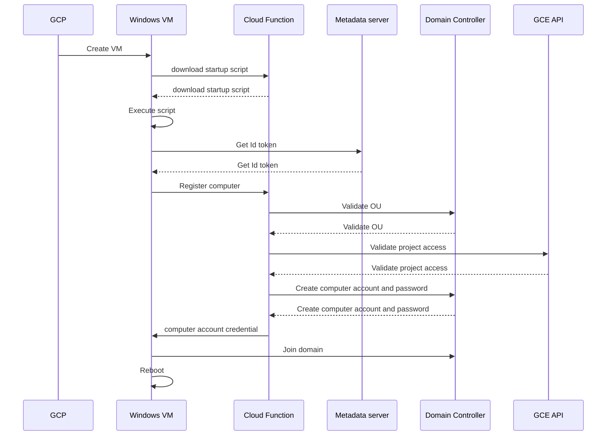

##  Overview

```mermaid
sequenceDiagram

GCP ->> Windows VM: Create VM
Windows VM ->> Cloud Function: download startup script
Cloud Function -->> Windows VM: download startup script
Windows VM ->> Windows VM: Execute script
Windows VM ->> Metadata server: Get Id token
Metadata server -->> Windows VM: Get Id token
Windows VM ->> Cloud Function: Register computer
Cloud Function ->> Domain Controller: Validate OU
Domain Controller -->> Cloud Function: Validate OU
Cloud Function ->> GCE API: Validate project access
GCE API -->> Cloud Function: Validate project access
Cloud Function ->> Domain Controller: Create computer account and password
Domain Controller -->> Cloud Function: Create computer account and password
Cloud Function ->> Windows VM: computer account credential
Windows VM ->> Domain Controller: Join domain
Windows VM ->> Windows VM: Reboot
```
##  Table of Content

[Domain Preparation](./domain-preparation.md)

[GCP Preparation](./gcp-preparation.md)

[Verify Domain auto join](./verify.md)