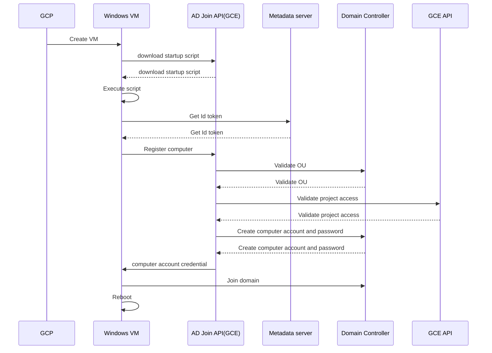

##  Overview

Below diagram illustrated process flow of domain automated join.

##  Table of Content

[Domain Preparation](./domain-preparation.md)

[GCP Preparation](./gcp-preparation.md)

[Verify Domain auto join](./verify.md)

##  Reference

[GCP Automated AD Join](https://github.com/GoogleCloudPlatform/gce-automated-ad-join)